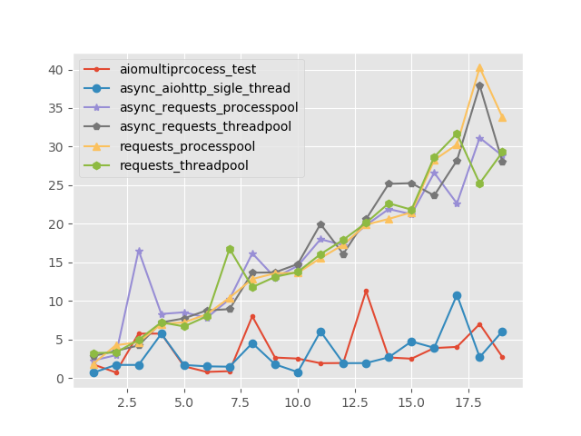

# Python 异步IO技术
异步(asynchronous)编程模式是相对于同步方式的另一种编程思路。 C10K的问题提出后， 各种编程语言都出现了解决高并发的技术栈， 而早在Python2时期， Twisted、Tornado和Gevent这三个库用不同的技术路径解决了高并发。[1] 其中就有用到Python的一些异步实现方法。 此文将对异步编程的基本思想和Python的实现方式进行阐述。

[目录]
- 概念解释，同步\异步\阻塞\非阻塞\协程
- 高并发问题解决方案：多线程与异步IO
- asyncio解决的问题
- Python异步IO生态圈
- 并发哪家强？应用：异步爬虫测试

## 概念解释，同步\异步\阻塞\非阻塞\协程
### 同步异步(Synchornous\Asynchronous)
这一概念是针对**主程序**来说的, 如果主程序遇到阻塞的任务时选择等待，那么这种行为就是同步的， 如果不等待选择执行其他的任务，就是异步的；
### 阻塞非阻塞(Blocking\Unblocking)
这一概念是针对**任务**来说的， 如果某项任务在执行费时IO操作时不能**挂起跳出**（不能把执行权归还主程序）那么此项任务就是阻塞的， 相反就是非阻塞的。

其实不必将上面四个概念区分的很清楚，只需明白异步非阻塞编程的基本思路是将**IO密集型的任务时间节省出来让CPU尽可能多地去完成计算密集型任务**；

### 协程(coroutines)
Python最早是用生成器写的协程，3.4后可以用asyncio.coroutine装饰一个协程，3.5加入了新的关键字**async\await**协程成为新的语法。3.6还引入了异步生成器。

协程的定义由很多，我比较认同**可以挂起中断的函数** 这一说法，前面概念中讲到非阻塞的任务是可以挂起中断的，那么协程正可以实现此项任务；

协程包含两种情况:
- 协程函数：async def 或者 @asyncio.coroutine
- 协程函数所返回的对象

协程的运作方式：
- 通过result = await future或者 result = yeild from future，悬挂协程，直到future完成，获取future的结果/异常
- 通过 result = await coroutine 或者 result = yeild from coroutine 等待另一个协程的结果（或者异常，异常会被传播）。
- returen expression 返回该协程的结果，被await，或者yield from获取。
- raise exception，抛出异常，被await，或者yield from获取。

协程的典型应用案例，摘自《Fluent Python》
```Python
# 计算移动平均值

from collections import namedtuple
Result = namedtuple('Result', 'count average')
# 子生成器
def averager():
    total = 0.0
    count = 0
    average = None
    while True:
        term = yield
        if term is None:
            break
        total += term
        count += 1
        average = total/count
        return Result(count, average)

# 委派生成器
def grouper(results, key):
    while True:
        results[key] = yield from averager()

# 客户端代码，即调用方
def main(data):
    results = {}
    for key, values in data.items():
        group = grouper(results, key) 
        # 协程需要激活
        next(group)
        for value in values:
            # 传递值给自生成器
            group.send(value) 
        group.send(None) # 重要！ 

    report(results)

# 输出报告
def report(results):
    for key, result in sorted(results.items()):
    group, unit = key.split(';')
    print('{:2} {:5} averaging {:.2f}{}'.format(
    result.count, group, result.average, unit))

data = {
'girls;kg':
[40.9, 38.5, 44.3, 42.2, 45.2, 41.7, 44.5, 38.0, 40.6, 44.5],
'girls;m':
[1.6, 1.51, 1.4, 1.3, 1.41, 1.39, 1.33, 1.46, 1.45, 1.43],
'boys;kg':
[39.0, 40.8, 43.2, 40.8, 43.1, 38.6, 41.4, 40.6, 36.3],
'boys;m':
[1.38, 1.5, 1.32, 1.25, 1.37, 1.48, 1.25, 1.49, 1.46],
}
if __name__ == '__main__':
    main(data)
```
调用协程函数并不能使该协程运行。调用协程函数所返回的协程对象，在被你安排执行之前，不会做任何事情。有两种方式可以启动它：[2]

- 通过在一个已经启动的协程中调用：await coroutine或者yield from coroutine
- 或者通过ensure_task()以及loop.create_task()安排协程的执行。(使用asyncio库)

## 高并发问题解决方案：多线程与异步IO
其实解决高并发就是实现的程序的异步和非阻塞，而多线程\多进程是大多数比较熟悉的方案，**将阻塞任务挂起到多个线程， 由操作系统实现线程\进程间的调度**，**concurrent.futures**对象的出现使得多线程的非阻塞任务可以使用**回调函数**, 参考下例:
```python
from concurrent.futures import ThreadPoolExecutor, as_completed, wait, FIRST_COMPLETED
from concurrent.futures import Future
from multiprocessing import Pool
from functools import partial
import time

def get_html(times):
    time.sleep(times)
    print("get page {} success".format(times))
    return times

executor = ThreadPoolExecutor(max_workers=2)

# 回调函数
def done_callback(msg, future):
    print(msg + 'this is called by callback!', future.result())

urls = [3,2,4]

all_task = [executor.submit(get_html, (url)).add_done_callback(partial(done_callback, 'XXX')) for url in urls]
wait(all_task, return_when=FIRST_COMPLETED)
```
executor.submit返回一个future对象，这个对象可以存储结果、取消、添加回调等等。熟悉前端的朋友们肯定想起来这与javascipt的promise对象的思想一致；

还有一种常见的写法是(使用进程与线程池，减少频繁创建线程)：
```python
NUMBERS = range(12)
URL = 'http://httpbin.org/get?a={}'

def fetch(a):
    r = requests.get(URL.format(a))
    return r.json()['args']['a']

def requests_threadpool():
    start = time.time()
    # 自动等待完成
    with ThreadPoolExecutor(max_workers=3) as executor:
        for num, result in zip(NUMBERS, executor.map(fetch, NUMBERS)):
            print('fetch({}) = {}'.format(num, result))
```
**多进程ProcessPoolExecutor**的接口与线程基本相同；他们实现异步非阻塞的问题是：
- 线程、进程的创建与切换由os完成，会消耗一定的时间和内存。
- 需写大量的回调函数

现在希望用单线程的方式实现异步和非阻塞，Python的协程实现了非阻塞任务，现在只需要一个**任务循环机制**就可以把任务的调度交由程序本身来完成，不经过操作系统调度可省下不少的时间。

## asyncio解决的问题
Python3.4正式加入的asyncio(读音请自行谷歌) 为单线程实现异步提供了任务循环机制，同时为协程提供了一些包装接口，使得协程不许要进过send\next等繁琐操作。同时引入了 **可等待对象(Awaitable)** 的概念;

可等待对象要实现的协议有__aiter__, __anext__,__aenter__,__aexit__;asyncio接口可以直接用的可等待对象是：
- 协程
- aysncio.future对象(底层API)
- Task对象（高级API）

future对象对协程包装成结果容器，使其可以像多线程中的future一样可以使用回调等功能；Task是future的子类，用于**同时启动多个协程\future**

对于这三个对象不理解的可以直接看官方文档中的阐述，其实大部分情况下不必使用底层的future对象；

几个asyncio常用的接口：
- **asyncio.run(coro, *, debug=True) 3.7** 这个函数可以视当前loop的情况启动协程
- **asyncio.create_task(coro) 3.7;** 将协程加入到任务队列中去立即执行
- *awaitable* asyncio.gather(*aws, loop=None, return_exceptions=False) 3.7；在队列中执行可等待对象
- *coroutine* asyncio.wait(aws, *, loop=None, timeout=None, return_when=ALL_COMPLETED) 3.7; 按照条件等待可等待对象的完成，是一种阻塞写法；

上面的接口都是3.7出现的，之前的写法中还会使用带队列loop, 在3.7中致力于取消loop的写法，使得用户更容易上手；

再次回顾一下asyncio最主要解决的问题：为可等待对象提供了调度多列，使得用户可以像写同步代码一样实现异步非阻塞操作，回避了写回调函数；

## Python异步IO生态圈
**协程中不能写阻塞的代码**，所以就不能使用阻塞的任务和库，如requests, pymysql等， 非得使用也可以，异步+多线程的方式仍然有效，而且asyncio也跟多进程一样实现了他自己的同步机制，一定程度上保证线程安全；但是我们都希望所有的任务都可以使用异步完成，目前，aio生态圈正在逐步完善，已经有如下项目：

### Web框架

*Libraries to build web applications.*

* [aiohttp](https://github.com/KeepSafe/aiohttp) - Http client/server for asyncio (PEP-3156).
* [sanic](https://github.com/channelcat/sanic) - Python 3.5+ web server that's written to go fast.
* [Quart](https://gitlab.com/pgjones/quart) - An asyncio web microframework with the same API as Flask.
* [Vibora](https://github.com/vibora-io/vibora) - Performant web framework inspired by Flask.
* [cirrina](https://github.com/neolynx/cirrina) - Opinionated asynchronous web framework based on aiohttp.
* [autobahn](https://github.com/crossbario/autobahn-python) - WebSocket and WAMP supporting asyncio and Twisted, for clients and servers.
* [websockets](https://github.com/aaugustin/websockets/) - A library for building WebSocket servers and clients in Python with a focus on correctness and simplicity.
* [Tornado](http://www.tornadoweb.org/en/stable/) - Performant web framework and asynchronous networking library.
* [Japronto!](https://github.com/squeaky-pl/japronto) - Experimental http toolkit built on top of uvloop and picohttpparser.
* [Starlette](https://github.com/encode/starlette) - A lightweight ASGI framework/toolkit for building high performance services.
* [uvicorn](https://github.com/encode/uvicorn) - The lightning-fast ASGI server.

### 消息队列

*Libraries to implement applications using message queues.*

* [aioamqp](https://github.com/Polyconseil/aioamqp) - AMQP implementation using asyncio.
* [aiozmq](https://github.com/aio-libs/aiozmq) - Asyncio (pep 3156) integration with ZeroMQ.
* [crossbar](https://github.com/crossbario/crossbar) - Crossbar.io is a networking platform for distributed and microservice applications.
* [asyncio-nats](https://github.com/nats-io/asyncio-nats) - Client for the NATS messaging system.
* [aiokafka](https://github.com/aio-libs/aiokafka) - Client for Apache Kafka.

### 数据库驱动

*Libraries to connect to databases.*

* [asyncpg](https://github.com/MagicStack/asyncpg) - Fast PostgreSQL Database Client Library for Python/asyncio.
* [asyncpgsa](https://github.com/CanopyTax/asyncpgsa) - Asyncpg with sqlalchemy core support.
* [aiopg](https://github.com/aio-libs/aiopg/) - Library for accessing a PostgreSQL database.
* [aiomysql](https://github.com/aio-libs/aiomysql) - Library for accessing a MySQL database
* [aioodbc](https://github.com/aio-libs/aioodbc) - Library for accessing a ODBC databases.
* [motor](https://github.com/mongodb/motor) - The async Python driver for MongoDB.
* [aioredis](https://github.com/aio-libs/aioredis) - [aio-libs](https://github.com/aio-libs) Redis client (PEP 3156).
* [asyncio-redis](https://github.com/jonathanslenders/asyncio-redis) - Redis client for Python asyncio (PEP 3156).
* [aiocouchdb](https://github.com/aio-libs/aiocouchdb) - CouchDB client built on top of aiohttp (asyncio).
* [aioinflux](https://github.com/plugaai/aioinflux) - InfluxDB client built on top of aiohttp.
* [aioes](https://github.com/aio-libs/aioes) - Asyncio compatible driver for elasticsearch.
* [peewee-async](https://github.com/05bit/peewee-async) - ORM implementation based on [peewee](https://github.com/coleifer/peewee) and aiopg.
* [GINO](https://github.com/fantix/gino) - is a lightweight asynchronous Python ORM based on [SQLAlchemy](https://www.sqlalchemy.org/) core, with [asyncpg](https://github.com/MagicStack/asyncpg) dialect.
* [Tortoise ORM](https://github.com/tortoise/tortoise-orm) - native multi-backend ORM with Django-like API and easy relations management.

### 网络

*Libraries to communicate in your network.*

* [AsyncSSH](https://github.com/ronf/asyncssh) - Provides an asynchronous client and server implementation of the SSHv2 protocol.
* [aiodns](https://github.com/saghul/aiodns) - Simple DNS resolver for asyncio

### 测试

*Libraries to test asyncio based applications.*

* [aiomock](https://github.com/nhumrich/aiomock/) - A python mock library that supports async methods.
* [asynctest](https://github.com/Martiusweb/asynctest/) - Enhance the standard unittest package with features for testing. asyncio libraries
* [pytest-asyncio](https://github.com/pytest-dev/pytest-asyncio) - Pytest support for asyncio.
* [aresponses](https://github.com/CircleUp/aresponses) - Asyncio http mocking. Similar to the [responses](https://github.com/getsentry/responses) library used for [requests](https://github.com/requests/requests)
* [aioresponses](https://github.com/pnuckowski/aioresponses) - Helper for mock/fake web requests in Python aiohttp package.

### 可选择的队列

*Alternative asyncio loop implementations.*

* [uvloop](https://github.com/MagicStack/uvloop) - Ultra fast implementation of asyncio event loop on top of libuv.
* [curio](https://github.com/dabeaz/curio) - The coroutine concurrency library.

### 其他

*Other awesome asyncio libraries.*

* [aiofiles](https://github.com/Tinche/aiofiles/) - File support for asyncio.
* [aiodebug](https://github.com/qntln/aiodebug) - A tiny library for monitoring and testing asyncio programs.
* [aiorun](https://github.com/cjrh/aiorun) - A `run()` function that handles all the usual boilerplate for startup and graceful shutdown.
* [aioserial](https://github.com/changyuheng/aioserial) - A drop-in replacement of [pySerial](https://github.com/pyserial/pyserial).
* [aiozipkin](https://github.com/aio-libs/aiozipkin) - Distributed tracing instrumentation for asyncio with zipkin

### 文档

*Documentation, blog posts, and other awesome writing about asyncio.*

* [Official asyncio documentation](https://docs.python.org/3/library/asyncio.html) - Asynchronous I/O, event loop, coroutines and tasks.
* [Short well-written intro to asyncio](http://masnun.com/2015/11/13/python-generators-coroutines-native-coroutines-and-async-await.html) - Generators, Coroutines, Native Coroutines and async/await.
* [Async Through the looking Glass](https://hackernoon.com/async-through-the-looking-glass-d69a0a88b661) - Nice writing about it's worth using asyncio or not for specific use-cases.
* [Asynchronous Python](https://hackernoon.com/asynchronous-python-45df84b82434) - Introduction into asynchronous programming with Python.
* [AsyncIO for the Working Python Developer](https://hackernoon.com/asyncio-for-the-working-python-developer-5c468e6e2e8e) - A gentle introduction to asynchronous programming from basic examples working up to URL fetching.
* [Test limits of Python aiohttp](https://pawelmhm.github.io/asyncio/python/aiohttp/2016/04/22/asyncio-aiohttp.html) - Making 1 million requests with python-aiohttp.

### 讨论

*Recordings of awesome talks about asyncio.*

* [Topics of Interest (Python Asyncio)](https://youtu.be/ZzfHjytDceU) | [screencast](https://youtu.be/lYe8W04ERnY) | [slides](https://speakerdeck.com/dabeaz/topics-of-interest-async) - PyCon Brasil 2015 keynote (David Beazley).
* [Python Asynchronous I/O Walkthrough](https://www.youtube.com/playlist?list=PLpEcQSRWP2IjVRlTUptdD05kG-UkJynQT) | [blog post](http://pgbovine.net/python-async-io-walkthrough.htm) - 8-part code walkthrough (Philip Guo).

## 并发哪家强？应用：异步爬虫测试
对着asyncio的文档示例多理解几个程序后， 我们就可以写几个IO密集操作的程序来测试与喜爱各种方案的效率了，我编写了一个简单的爬虫，没有写储存的IO，只测试请求的IO。分别用了以下几个方案：
- requests + ThreadPool
- requests + ProcessPool
- asyncio + requests + ThreadPool
- asyncio + requests + ProcessPool
- asyncio + aiohttp +SingleThread
- asyncio + Multiporcess (这个我直接选用了库[aiomultiporcess](https://github.com/jreese/aiomultiprocess))

完整的代码[在这里](https://github.com/LouisYZK/dist/tree/master/aio/test_spider)


最终结果：


可以看出在requests库+多线程上面套用异步是无效的，而aiohttp的多线程并没有效率上的明显提升。


## 参考资料
[1] [dongweiming的博客](http://www.dongwm.com/post/80/)
[2] [segmentFault问答](https://segmentfault.com/a/1190000012631063)
[3] [Asyncio官方文档](https://docs.python.org/3/library/asyncio-task.html#task-object)
[4] [Awesome-asyncio](https://github.com/timofurrer/awesome-asyncio)
[5] [《流畅的Python》](https://www.amazon.cn/dp/B072HMKKPG/ref=sr_1_1?ie=UTF8&qid=1550152947&sr=8-1&keywords=%E6%B5%81%E7%95%85%E7%9A%84python)
[6] PyCon 2017\2018 相关内容
